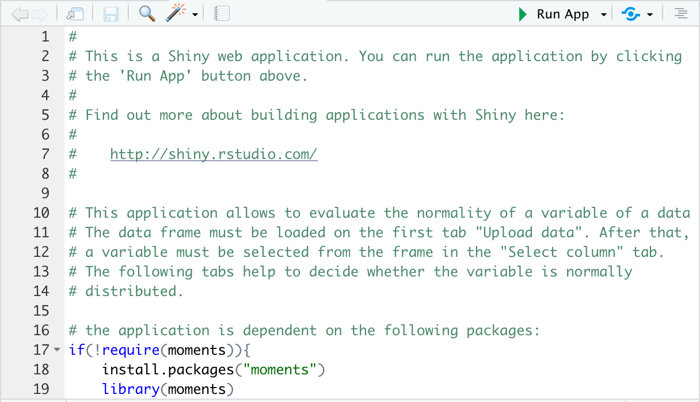
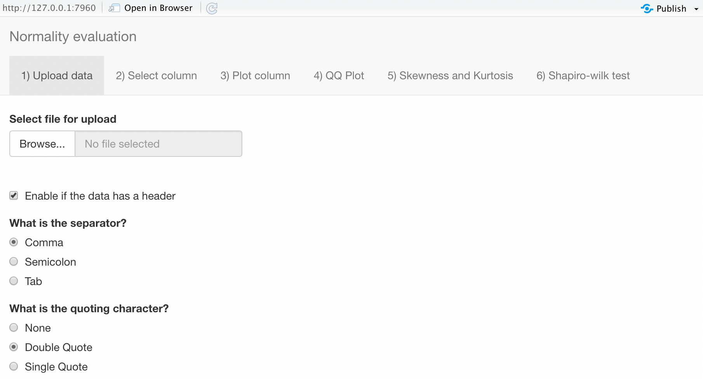
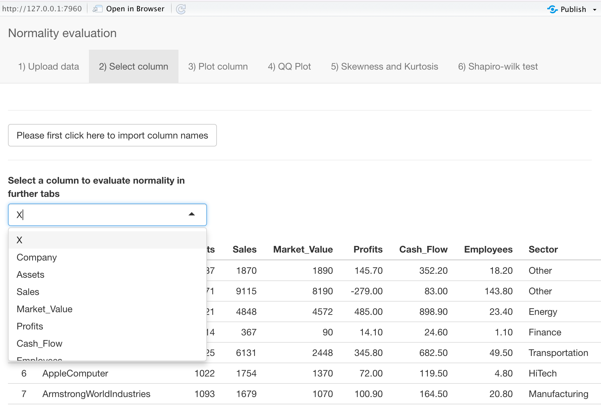
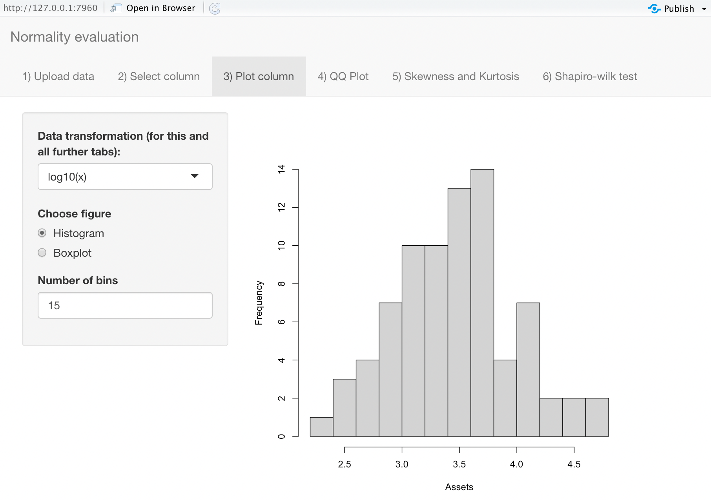
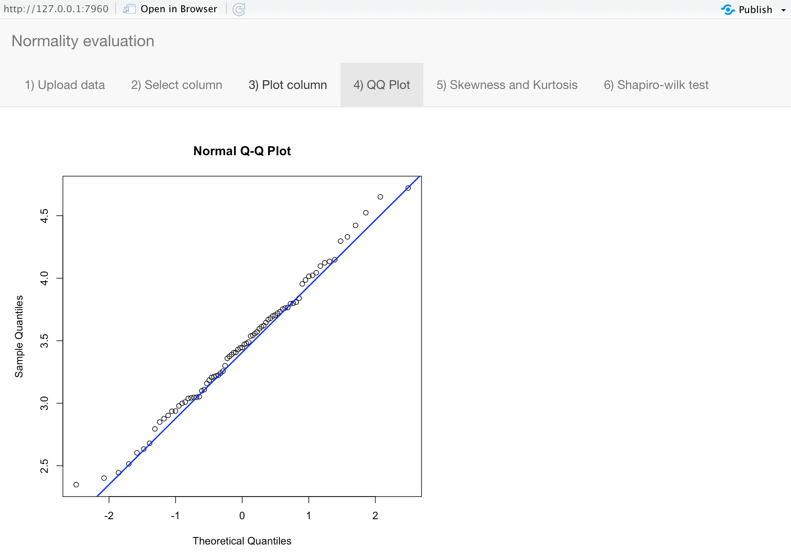
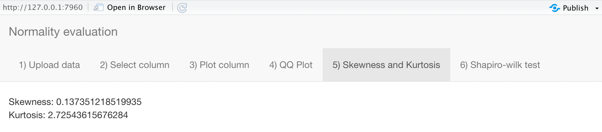
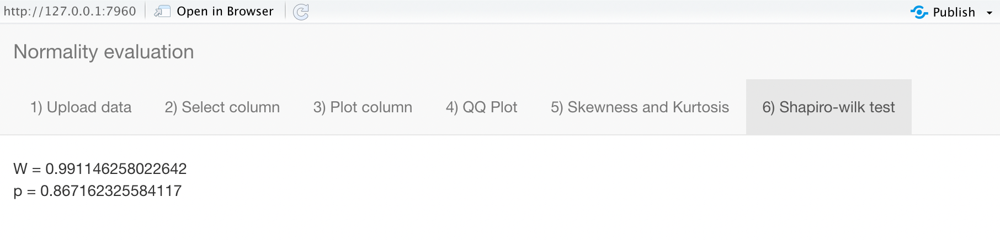

# Normality_evaluation
This application allows to evaluate the normality of a variable of a data frame. The data frame must be loaded on the first tab ``Upload data``. After that, a variable must be selected from the frame in the ``Select column`` tab. The following tabs help to decide whether the variable is normally
distributed based on visualizations (Histogram, Boxplot, QQ Plot), kurtosis, skewness, and a Shapiro-Wilk test.

## Step-by-step guide

Open the code (preferrably in ) and run it using the ``Run App`` button in the top right corner.  

 

----------------------

Select your data with ``Browse`` and adjust the options as needed.  

  

----------------------

Click the field to update to your column names and choose the variable of interest from the drop down menu.

  

----------------------

Apply transormations to the variable (optional).  
Visualize your variable with a histogram or a boxplot.  

  

----------------------

Display a QQ Plot of the variable.

  

----------------------

Get the Kurtosis and the Skewness of the variable.  

  

----------------------

Apply a Shapiro-Wilk test. Here the test suggests no deviation from normality (p > 0.05).  

  

----------------------
